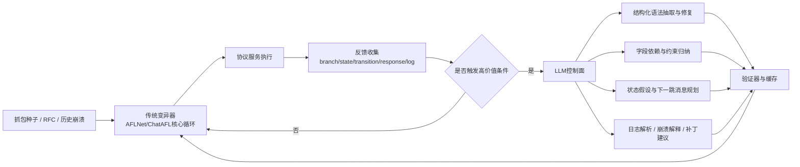

# 在 ChatAFL 基础上引入大模型的网络协议模糊测试研究报告

## 执行摘要

你的研究方向**总体靠谱，而且有较强的可发表性**。原因很直接：一方面，协议模糊测试的关键痛点——**状态空间深、输入强结构化、网络 I/O 吞吐低、种子多样性不足**——到 2024–2025 仍然没有被彻底解决；另一方面，近两年高水平论文已经证明，LLM 在 fuzzing 中最有价值的角色不是“替代变异器”，而是**以稀疏、高价值的方式补足协议知识、复杂约束与自动化工程能力**。AFLNet 开启了状态感知网络协议灰盒 fuzzing；StateAFL、NSFuzz、SGFuzz 等工作说明“**状态表示与同步机制**”是成败关键；ChatAFL 则把 LLM 正式引入协议 fuzzing，并在六个文本协议实现上相对 AFLNet/NSFUZZ 取得了**47.60% 的状态转移覆盖提升、29.55% 的状态覆盖提升、5.81% 的代码覆盖提升**，同时发现了 **9 个此前未知漏洞**。但 ChatAFL 也明确承认其设计主要面向**带公开 RFC 的文本协议**，并且现有 artifact 依赖外部 OpenAI API，这些都给你留下了很清晰的增量创新空间。citeturn9view0turn10view4turn28view4turn32view2turn13view0turn15view4turn15view6

如果你想在 ChatAFL 基础上做出一篇更稳妥、也更容易发表的论文，我的核心判断是：**不要把 LLM 放进每次执行的热路径，而应把它作为“验证驱动、预算感知、状态一致”的稀疏信息增强器**。换句话说，最值得做的不是“让模型每轮都生成消息”，而是让模型在以下高价值时刻发力：**离线/低频语法提取、字段依赖与约束归纳、覆盖停滞时的下一跳消息规划、日志/崩溃解释、以及自动化调度策略**。这一路线与 ChatAFL、PromptFuzz、HLPFUZZ 的成功经验一致，也与 AFLNetLegion、NSFuzz、FSFuzzer 对吞吐瓶颈的观察一致：**协议 fuzzing 的上限不仅由“更聪明的状态选择”决定，还被吞吐、同步和无效输入比例强烈限制**。citeturn8view3turn21view2turn21view1turn33view1turn28view4turn24search2

基于此，本报告给出的最推荐研究主线是：**“验证驱动的 LLM 协议知识抽取 + 依赖保持的语义变异 + 预算感知的多模型调度”**。这条主线既保持了对 ChatAFL 的增量性，又能形成清晰、可量化、可复现实验设计；如果你还想进一步提高创新度，可以把 **“状态假设图与下一跳规划”** 或 **“面向半结构化/二进制协议的片段提升”** 作为增强贡献加入。整体上，我认为该方向完全可以冲击 **NDSS / USENIX Security / CCS / ACSAC / RAID** 这类安全会议，或者以更偏系统评估和实验充分性的方式投向 **ISSTA / FSE / ICSE / ASE / ICST / SANER**；如果做成更大规模、包含 artifact 和长期实验的扩展版，也适合走 **EMSE / TOSEM / TDSC** 这类期刊路线。这个判断不是抽象乐观，而是有明确先例支撑：AFLNet 发表在 ICST，ProFuzzBench 在 ISSTA，StateAFL 在 EMSE，ChatAFL 在 NDSS，PromptFuzz 在 CCS，HLPFUZZ 在 USENIX Security。citeturn13view1turn16search2turn13view2turn13view0turn21view2turn21view1

## 研究目标与问题定义

你要解决的，不是“能否把大模型接进协议 fuzzing”，因为 ChatAFL 已经回答了这个问题；真正的问题是：**如何在不显著破坏吞吐、可复现性与成本可控性的前提下，让 LLM 稳定提升状态探索深度、输入语义有效性与漏洞发现效率**。现有研究说明，协议 fuzzing 的三类核心瓶颈分别是：**状态表示过粗**、**输入结构/语义约束难以显式编码**、以及**网络与同步导致的低吞吐**。AFLNet 依赖响应码来表示状态，StateAFL 与 NSFuzz 改用内存/状态变量增强状态反馈，AFLNetLegion 则进一步表明：即使改进状态选择算法，如果状态模型太粗、吞吐太低，整体收益也会变得不显著。citeturn9view0turn10view4turn28view3turn33view1

因此，本课题建议把问题定义为一个联合优化问题：在给定时间预算、计算预算和 LLM 查询预算下，最大化  
**深状态探索能力 + 语义有效输入比例 + 单位时间/单位成本漏洞发现效率**，同时约束  
**可复现性、可解释性和数据外发风险**。这一问题定义比单纯追求 branch coverage 更适合 LLM 介入后的系统，因为 ChatAFL 也明确指出：覆盖率只是 bug-finding 的代理指标，最终仍需以崩溃重现、唯一漏洞去重和开发者确认来闭环。citeturn32view0turn32view2

建议采用以下研究假设。第一，**验证驱动的结构化协议知识抽取**会比 ChatAFL 的一次性语法提取更稳，因为 ChatAFL 已观察到 LLM 在语法抽取中存在随机性，例如 RTSP 的 PLAY 语法中，“Range” 字段会在部分回答中被遗漏。第二，**依赖保持的字段级语义变异**会比“只知道消息类型/字段边界”的结构感知变异更有效，因为协议实现往往受会话 ID、序号、长度、token、权限模式等跨字段约束影响。第三，**稀疏、预算感知的 LLM 调用**会优于频繁调用，因为协议 fuzzer 吞吐本来就低，AFLNetLegion 与 NSFuzz/FSFuzzer 的结果都表明，吞吐和同步开销本身就是决定收益的重要因素。第四，**把 LLM 用作状态规划器或复杂约束求解器**，通常比把它用作“每轮消息生成器”更有性价比，这与 HLPFUZZ 把 LLM 放在复杂约束求解位置的思路是一致的。citeturn15view3turn7view5turn33view1turn28view4turn24search2turn21view1

评价指标建议分为五组。基础组沿用 ChatAFL/ProFuzzBench：**分支覆盖、状态覆盖、状态转移覆盖、唯一漏洞数、首个崩溃时间**。质量组加入 **有效输入率** 与 **语义一致性得分**，前者统计请求通过协议早期校验/进入深层处理逻辑的比例，后者统计关键字段依赖是否保持一致。效率组统计 **exec/s、覆盖增长斜率、单位 LLM token 带来的状态/覆盖收益**。复现组统计 **相同 prompt+seed+cache 下的结果方差** 与 **崩溃重现实验成功率**。解释组统计 **日志/ASAN triage 的时间开销** 与 **根因解释的一致性**。其中前四个基础指标可以直接复用 ChatAFL 的测量方式：分支覆盖由 ProFuzzBench 自动工具统计，状态与转移覆盖由自动状态工具统计，漏洞通过 ASAN + stack trace 去重，并用 AFLNet-replay 复现。citeturn5view8turn32view0turn32view1

## 现有工作综述

从技术脉络看，协议模糊测试大致经历了三条路线的叠加。第一条是**基于规格或模型的黑盒/白盒协议 fuzzing**，代表如 PULSAR、boofuzz，这类方法控制力强，但通常需要显式协议模型或额外逆向。第二条是**状态感知灰盒 fuzzing**，代表如 AFLNet、StateAFL、NSFuzz、SGFuzz 和相关的状态选择研究，这一分支把重点放在“如何自动获得更有用的状态反馈”。第三条则是最近两年的**LLM/ML 赋能 fuzzing**：ChatAFL 把 LLM 用于协议语法、种子和停滞突破；PromptFuzz 把 LLM 用于 fuzz driver 生成；HLPFUZZ 把 LLM 用作复杂约束求解器。对于你现在的研究语境而言，最重要的战略判断是：**协议 fuzzing 的新创新不能只停留在“更好 prompt”层面，而要落在状态表示、输入语义有效性、系统吞吐和可复现工程上**。citeturn26view0turn5view9turn9view0turn10view4turn28view4turn13view0turn21view2turn21view1

下表汇总了与你选题最相关的代表性工具与论文。表中优先使用原始论文与官方仓库，并在描述中给出中文概括，便于你后续直接定位原文与实现。

| 工具 / 方法 | 输入策略与状态策略 | 模型类型 | 主要优点 | 主要短板 | 适用场景 | 原始资料 |
|---|---|---|---|---|---|---|
| AFLNet | 以抓包得到的消息序列为种子；代码覆盖 + 响应码作为状态反馈；无须协议规格 | 无 | 第一个较成熟的状态感知网络协议灰盒 fuzzer；可直接基于真实会话变异；发现过 2 个高危 0-day | 状态粒度粗；结构/语义无感；吞吐偏低 | 有可录制真实会话、可源码插桩或可执行重放的开源服务 | 论文与仓库 citeturn9view0turn9view3turn13view1 |
| AFLNetLegion | 在 AFLNet 上引入 MCTS/Legion 风格状态选择 | 无 | 证明“状态选择算法”本身值得研究；在个别 case study 有优势 | 总体提升不显著；论文直接指出 AFLNet 的粗粒度状态与低吞吐是关键瓶颈 | 想研究状态选择层而不改消息语义层时 | 论文与实现 citeturn33view1turn23search1 |
| StateAFL | 编译期插桩；运行时抓长生命周期内存快照并做 fuzzy hash 推断状态 | 无 | 不依赖协议解析器；可用于二进制协议；在 13 个开源网络服务上验证 | 有后处理开销；需要源码与编译期插桩 | 二进制协议、响应码不可靠或无显式状态码的服务 | 论文与仓库 citeturn10view4turn10view0turn13view2 |
| NSFuzz | 静态分析提取事件循环与状态变量；轻量编译期插桩；实时状态追踪与快速同步 | 无 | 状态更可解释；吞吐相对 AFLNet/StateAFL 可提升到 50x；覆盖可提升到 20% | 强依赖源码和静态分析质量；工程耦合度高 | 源码可得，且你愿意做编译期改造的目标 | 论文 citeturn28view0turn28view3turn28view4 |
| ChatAFL | LLM 提取消息语法、扩充初始种子、在 coverage plateau 时生成新消息 | LLM | 直接把 RFC/协议知识转成机器可用信息；相对 AFLNet 平均提升 47.60% 状态转移、29.55% 状态、5.81% 分支覆盖；发现 9 个未知漏洞 | 主要面向带公开 RFC 的**文本协议**；有随机性；artifact 依赖 OpenAI API | 文本协议、RFC 充足、希望快速验证 LLM 价值时 | 论文与仓库 citeturn8view1turn8view2turn13view0turn15view4turn15view6 |
| PULSAR | 从网络流量中逆向状态机与消息模板，再基于模型进行黑盒状态引导 fuzzing | 统计/协议逆向模型 | 面向**专有协议**与无源码场景；能模拟通信并探索深状态 | 主要是黑盒建模；缺少灰盒覆盖反馈；构建模型成本较高 | 私有协议、嵌入式或闭源设备 | 论文与开源实现 citeturn26view0 |
| Snipuzz | 基于响应差异推断 message snippets；对 IoT 设备进行黑盒片段化变异 | 启发式聚类 / 片段推断 | 不依赖源码与规格；在 20 个设备上找出 5 个 0-day；非常适合“无文档设备” | 反馈信号较弱；主要针对 IoT 与响应可观测设备；可解释性一般 | IoT、黑盒设备、半结构化消息 | 论文与仓库 citeturn6view9 |
| boofuzz | 人工编写消息模板、状态机与变量依赖的 model-based fuzzing | 无 | 控制精细、结果可复现、工业上易理解 | 手工建模成本高；自动化差；对未知协议不友好 | 规格已知、人工可建模、需要精细控制的协议测试 | 官方仓库 citeturn5view9 |
| Skyfire / Learn&Fuzz | 从样本或语法学习结构，生成高质量结构化种子；或学习输入分布指导 fuzz | 统计模型 / 神经网络 | 说明“结构有效输入”能显著提升深层代码探索；适合作为 ChatAFL 语法生成的前身参照 | 不解决状态空间问题；多数针对文件格式/解析器而非网络会话 | 结构化输入、语法丰富但状态性较弱的目标 | 原始论文 citeturn5view5turn5view6 |
| NEUZZ | 学习程序分支行为的平滑代理；用梯度指导输入修改 | 神经代理模型 | 证明 ML 可用于“难分支约束突破”；在 10 个真实程序上优于多种灰盒 fuzzer | 训练成本高；不面向协议状态；输入往往按字节视角建模 | 用作“复杂局部约束突破”的思想来源 | 原始论文与实现 citeturn5view7turn17search2 |
| PromptFuzz / HLPFUZZ | 用 LLM 生成 fuzz driver，或在覆盖停滞时把 LLM 当作复杂约束求解器 | LLM | 说明 LLM 最适合放在**高价值、稀疏调用**位置：PromptFuzz 在 14 个库上提升 fuzz driver 覆盖，HLPFUZZ 在 9 个语言处理器上最高提升 190% 覆盖并找到 52 个 bug | 都不是网络协议专用；迁移到协议场景需要重新定义约束与反馈 | 作为你设计“预算感知调度器”和“下一跳消息规划器”的直接灵感来源 | 原始论文 citeturn21view2turn21view1 |

从对比中可以得出几个对你最关键的结论。第一，**ChatAFL 是你当前最自然、也最强的直接基线**，因为它已经把 LLM 引到协议 fuzzing 主干流程里，而且开源可复现。第二，**AFLNet/StateAFL/NSFuzz/SGFuzz 的真正分歧不只是“怎么选状态”，而是“状态到底如何表示、如何同步、吞吐是否足够”**。AFLNetLegion 的结果尤其值得重视：单纯改状态选择算法，总体收益可能很有限。第三，**最近的 LLM-fuzzing 成功案例几乎都把 LLM 放在“低频但高价值”的位置**，例如约束求解器、driver 生成器、或协议知识提取器，而不是每次执行都调用模型。对你来说，这直接指向一条更稳的研究路径：**让 LLM 成为“协议知识和复杂约束的外脑”，而不是“热路径消息生成器”**。citeturn33view1turn28view4turn13view0turn21view2turn21view1

## 大模型在模糊测试中的潜在角色与调用方式

在协议 fuzzing 里，LLM 最适合承担的是**信息缺口填补者**，而不是整个测试循环的控制器。ChatAFL 已经验证了三类角色：**语法抽取、种子扩充、覆盖停滞突破**。PromptFuzz 和 HLPFUZZ 又进一步说明，LLM 在 fuzzing 里的高价值职责还包括：**自动化程序/driver 生成、复杂约束求解、解释性分析**。这些工作共同说明，LLM 和传统 mutational engine 的最佳关系不是替代，而是分工：传统 fuzzer 负责高吞吐探索，LLM 负责解决“普通变异器很难解决、但又无需每轮都解决”的问题。citeturn7view0turn15view4turn21view2turn21view1

从实现角度看，可以把 LLM 的调用分成**冷路径**、**温路径**和**尽量避免的热路径**。冷路径包括离线语法提取、字段依赖分析、崩溃 triage、补丁建议等；这类任务追求质量和可解释性，可以使用较大的通用指令模型或代码模型。温路径包括 coverage plateau 时的“下一跳消息规划”、种子修复与小规模候选生成；这类任务必须受预算控制，适合做触发式调用。热路径则是“每轮/每包都问模型怎么变异”，这通常不划算，因为协议 fuzzing 的系统瓶颈本来就比文件 fuzzing 更重，AFLNetLegion 已经指出 AFLNet 的吞吐远低于普通无状态 fuzzer，而 NSFuzz/FSFuzzer 则从另一侧说明同步与执行效率本身会吞没很多算法收益。citeturn33view1turn28view4turn24search2

可以操作的角色与调用方式如下。

| 角色 | 调用方式 | 建议模型类型 | 技术可行性 | 资源需求 | 主要风险 |
|---|---|---|---|---|---|
| 语义/语法有效输入生成 | 离线提取消息类型、字段、依赖；在线只做受限修复或少量补种 | 通用指令模型 + 结构化输出 | 很高，已被 ChatAFL 直接验证 | 中等；主要消耗在 prompt 与验证上 | 幻觉结构、遗漏字段、不同回答不一致 |
| 协议状态推理与下一跳规划 | 仅在 plateau 或到达特定状态簇时触发；输入为简化后的通信历史与状态摘要 | 中等以上规模指令模型；可辅以小 code LLM | 高，但需设计状态摘要与验证闭环 | 中等；与 plateau 频率相关 | 错判当前状态、生成不可执行消息、延迟上升 |
| 反馈驱动策略自动化 | 根据当前有效输入率、覆盖斜率、token 预算决定是否调用 LLM、调用哪个子模块 | 小型本地模型或启发式调度器；不必每次都用大模型 | 很高；工程上最稳 | 低到中等 | 调度策略与奖励设计不当，收益不稳定 |
| 补丁建议与日志解析 | 对 ASAN、server log、崩溃消息序列、RFC 片段做 post-mortem 分析 | 代码模型或通用大模型 | 高；与 PromptFuzz/HLPFUZZ 的“解释型 LLM 组件”一致 | 低；不在热路径 | 解释看似合理但并不对应真实根因 |
| 模糊策略自动化 | 自动生成字典、字段值域、变异模板、测试脚本 | 小到中型指令模型即可 | 很高；收益主要在工程效率 | 低 | 模板偏保守导致探索下降 |
| Harness / 服务编排辅助 | 自动生成 replay、清理脚本、日志解析器、容器配置 | 代码模型 | 高；PromptFuzz 已证明 LLM 在 fuzz driver 生成上有效 | 低到中等 | 代码质量波动，需要 CI 验证 |

在接口层，我建议你统一采用**OpenAI-compatible API**，但**优先支持本地/私有部署**。这是因为当前的 vLLM、llama.cpp 与 Hugging Face TGI 都提供了 OpenAI 兼容接口；其中 vLLM 还支持带 JSON、regex、grammar 等约束的结构化输出，OpenAI 官方也明确建议在可行时优先使用 Structured Outputs 而不是普通 JSON mode。对你来说，这意味着可以把 ChatAFL 原有的模型调用层做成**可插拔后端**：研发初期可以用外部 API 快速验证，正式实验和涉敏协议测试则切到本地部署，同时保留相同的客户端代码与缓存协议。citeturn27search2turn27search0turn27search4turn27search1turn27search3

这里最需要重视的不是“模型是否足够大”，而是**如何把随机性、成本和隐私风险压到工程可接受范围**。ChatAFL 已经观察到语法抽取具有随机性，因此采用了低温度与多次重复自一致；它也显式限制无效 prompt 次数来控制成本，并要求用户自行配置 OpenAI API key。对你的系统设计而言，这三点都非常重要：第一，要把模型输出约束成结构化格式，并进行程序侧验证；第二，要做**prompt versioning + response cache + self-consistency**；第三，对专有协议、闭源设备或内部日志，优先使用本地部署，避免把原始流量直接送到云端 API。citeturn15view2turn15view3turn15view5turn15view6

## 基于 ChatAFL 的增量改进设计

综合现有工作与可实现性，我建议你把增量改进设计成“**四个稳妥方向 + 一个高创新可选方向**”。这五个方向都直接建立在 ChatAFL 已验证的三条 LLM 通道之上，但分别补 强其**随机性、语义依赖、状态规划、成本控制和协议范围**五个薄弱点。其设计依据主要来自：ChatAFL 的三阶段 LLM 集成与文本协议限制、StateAFL/NSFuzz 对状态反馈精度的提升、Snipuzz 对无语法黑盒片段推断的启发、以及 PromptFuzz/HLPFUZZ 对“LLM 作为稀疏求解器”的证明。citeturn7view0turn15view4turn10view4turn28view4turn6view9turn21view2turn21view1

| 改进方向 | 目标 | 方法 | 所需模型类型与接口 | 实现难度 | 预期收益 | 评估方法 |
|---|---|---|---|---|---|---|
| 验证驱动的结构化语法提取与自动修复 | 提高语法正确率、降低 LLM 幻觉与随机性 | 让模型输出 JSON/CFG 形式的消息语法、字段类型、可选/必选约束与示例；用运行时验证器做字段级 probe 和记分；对低置信字段触发自动重问或回退到字节级变异 | 通用指令模型；Structured Outputs；OpenAI-compatible API | 中等 | 提高有效输入率、减少无效 prompt、提升复现性 | 对照 RFC/手工 ground truth 的字段 precision/recall；有效输入率；branch/state/transition coverage |
| 依赖保持的字段级语义变异 | 让变异器不只“像消息”，而且“像会话中的消息” | 在 ChatAFL 的 grammar-guided mutation 基础上加入跨字段依赖图，如 CSeq、Session、长度、token、权限模式、header/body 对应关系；变异时做 typed mutation 和 dependency-preserving edit | 通用指令模型或小 code LLM；结构化输出 + 规则引擎 | 中等 | 进入深层状态的概率更高；减少早期 reject；更容易触发逻辑漏洞 | 深状态转移数、请求通过率、崩溃数、首崩时间；字段一致性检查 |
| 状态假设图与下一跳消息规划 | 提升对未知状态空间的导航能力 | 维护“观测状态图”：节点不是单一响应码，而是响应码、近因消息类型、关键变量/日志摘要的组合；plateau 时让模型基于当前历史推测“最可能引发新状态的下一类消息”，再由传统变异器具体化 | 中到大型指令模型；可选 code LLM；缓存必需 | 中高 | 提高 transition coverage，减少盲目扩种 | Plateau 恢复次数、每次恢复后的新增状态/转移、单位调用收益 |
| 成本/收益感知的多模型调度与缓存 | 在不拖垮吞吐的前提下保留 LLM 收益 | 设计 contextual bandit/启发式调度器，按“新增状态/覆盖/漏洞收益 ÷ 耗时/耗 token”选择调用：大模型做离线语法，小模型做在线规划，本地模型优先，云模型兜底 | 本地小模型 + 可选云端大模型；统一 OpenAI-compatible API | 中等 | 提高 coverage-per-dollar、coverage-per-minute；增强工程可落地性 | exec/s、单位 token 覆盖收益、总成本、相同预算下的最终覆盖 |
| 面向半结构化/二进制协议的片段提升扩展 | 把 ChatAFL 从文本 RFC 协议扩展到 MQTT/DNS/Modbus/SMB 等更有创新性的协议 | 借鉴 Snipuzz 的 response-based snippet inference 和 StateAFL/NSFuzz 的程序反馈，把字节片段先分块，再让 LLM 给出“可能的字段语义与依赖名称”；构造“片段 grammar”进行半语义变异 | 小到中型指令模型；优先本地部署；需额外切片与验证模块 | 高 | 这是最有潜力形成“明显超越 ChatAFL”的贡献点 | 在半结构化/二进制协议上的有效输入率、状态转移、崩溃数，与 ChatAFL/AFLNet/StateAFL 比较 |

如果你希望先做一篇**稳妥、完成度高、容易讲清楚因果链条**的论文，我建议优先做前三个里的 **“语法验证 + 语义依赖变异 + 成本调度”**。这三者之间耦合自然，而且都能在 ChatAFL 的代码基上较平滑地迭代：第一项改造其 grammar extraction，第二项增强其 grammar-guided mutation，第三项重写其 plateau 和 API 调用逻辑。相比之下，“状态假设图”更有研究味，但实现和评估都会更复杂；“半结构化/二进制扩展”创新度最高，却也是最耗时间、最容易在工程细节上拉长战线的方向。基于发表策略，我反而建议把第五项做成**第二阶段增强实验或下一篇论文的起点**。这一判断与 ChatAFL 的已知限制、AFLNetLegion 对吞吐/状态粗糙的诊断，以及 Snipuzz 对黑盒分片推断的启发是一致的。citeturn15view4turn33view1turn6view9

## 研究路线与实验计划

如果你没有预先锁定协议、硬件和时间预算，我建议采用“**双阶段协议集**”策略。第一阶段做**稳妥复现实验**，优先选择 ChatAFL 已覆盖的文本协议，如 **RTSP、FTP、SMTP、SIP、DAAP**，并可加入 **HTTP/1.1** 作为轻量扩展；这样你的比较对象最清晰，协议规格公开、种子易获得、ChatAFL 本身就有证据说明这类协议最适合当前框架。第二阶段再做**扩展创新实验**，选择 **MQTT、DNS、Modbus/TCP、DTLS/TLS** 中的 2–3 个目标，用来验证你是否真正突破了“只适配文本 RFC 协议”的限制；如果你追求更高风险高收益的方向，可以把 **SMB** 或专有协议流量加入长期计划，但不建议作为首篇论文的主战场。ChatAFL 的 benchmark 本身覆盖六个文本协议实现，ProFuzzBench 和 StateAFL 则覆盖了更多二进制与文本协议实现，2025 年的 LLMFuzz 工作也已经把 HTTP、MQTT、Modbus 纳入扩展基准。citeturn15view2turn5view8turn10view5turn22view1

基线比较建议分三层。第一层是**必须有的直接基线**：AFLNet、ChatAFL、以及你自己的 ablation 版本。第二层是**状态反馈基线**：StateAFL 或 NSFuzz，前提是目标有源码并且你愿意做编译期改造。第三层是**可选的思想基线**：如果你重点做状态规划，可以加入 AFLNetLegion；如果你重点做黑盒/半黑盒扩展，可以加入 Snipuzz 或 PULSAR 风格组件作横向讨论。实验统计至少应该达到：正式论文主实验 **5–10 次重复、每次 12–24 小时**；其中最强说服力的主表建议对齐 ChatAFL 的做法，使用 **10 次、24 小时** 的平均结果，并报告效应量或非参数检验结果。citeturn32view0turn32view1turn33view1

硬件上，可以分成三档。**轻量开发档**适合单人快速迭代：16–32 核 CPU、64–128GB 内存、可选 1 块 24GB 级 GPU，主打 2–3 个协议、3–5 次重复、短时 ablation。**标准论文档**建议 64–96 核 CPU、256GB 内存，LLM 后端可以是 1 块 48GB 级 GPU 或本地多卡+少量云 API；这足以跑 5–8 个协议和完整对照。**Artifact / 大规模档**则可参考 ChatAFL 的实验基础设施：Xeon 8468V、192 逻辑核、512GB 内存。需要强调的是，这种“豪华机器”不是立项门槛，而是完整 artifact 复现实验的上限参考；如果你采用本地 OpenAI-compatible serving，llama.cpp、vLLM、TGI 都可以让你在相同调用接口下灵活切换模型与部署形态。citeturn32view0turn27search4turn27search1turn27search3

在实验管线上，建议严格复用 ProFuzzBench 的自动化思想：容器化目标、统一 seed corpus、统一 coverage 收集、统一 crash reproduction，并在此基础上新增三类 artifact：**prompt 文件与版本库、response cache、字段验证与日志解析脚本**。与此同时，所有崩溃都应走 **ASAN + stack trace 去重 + replay 重现** 流程，避免“只做 coverage、不做漏洞确认”的常见弱点。对你这种要发表论文的工作而言，**bug validation、prompt cache 与可复现实验脚本** 的价值几乎和算法本身一样重要。citeturn5view8turn32view0turn15view6

下表给出一个适用于首篇论文的标准里程碑计划。若你只有 12–14 周，可以把协议收缩到 3–4 个文本协议，并只实现“方向一 + 方向二 + 方向四”。

| 里程碑 | 时间估计 | 主要工作 | 可交付物 |
|---|---|---|---|
| 环境统一与基线复现 | 2–3 周 | 统一 AFLNet / ChatAFL / ProFuzzBench 环境；确认 seed、字典、日志、coverage 管线可跑通 | 可重复执行脚本；基线 coverage 曲线；复现实验记录 |
| 指标与验证基础设施 | 2 周 | 增加有效输入率、字段一致性、LLM 成本、cache 命中率、crash replay 成功率的采集模块 | 指标采集器；分析 notebook；初版统计脚本 |
| 结构化语法提取与修复 | 3–4 周 | 实现结构化输出、字段置信度、运行时验证器、自动重问/回退逻辑 | 方向一原型；语法准确率实验 |
| 语义依赖变异器 | 3–4 周 | 实现字段依赖图、typed mutation、跨字段一致性维护 | 方向二原型；有效输入率与 transition 提升实验 |
| 成本调度与本地模型后端 | 3 周 | 接入本地 OpenAI-compatible serving；实现预算感知调度器与 cache | 方向四原型；coverage-per-dollar / per-minute 结果 |
| 状态规划增强 | 3–5 周 | 维护状态假设图；实现 plateau 触发式下一跳规划 | 方向三实验版；plateau 恢复效果分析 |
| 扩展协议与泛化验证 | 3–5 周 | 加入 HTTP/MQTT/DNS/Modbus 中的 2–3 个目标；做跨协议泛化 | 扩展实验；泛化与失败案例分析 |
| 漏洞确认与论文撰写 | 3–4 周 | 崩溃去重、复现、根因分析、与维护者沟通；整理 artifact | 论文初稿；artifact 包；漏洞报告与附录 |

## 风险评估与可发表性评价

从“靠谱性”角度看，这个方向**不是赌赛道，而是追热点中的真空地带**。ChatAFL 已经证明 LLM 能有效提升协议 fuzzing 的状态空间与代码覆盖；PromptFuzz 和 HLPFUZZ 又说明，LLM 在 fuzzing 中不只适用于自然语言生成，还能作为**自动化程序生成器**和**复杂约束求解器**。与此同时，2025 年已经出现针对协议 fuzzing 的综述、扩展基准与后续尝试，这说明社区并没有认为“ChatAFL 已经把题做完了”，反而说明**协议 + LLM fuzzing 还处于快速扩张、尚未定型**的阶段。对研究者来说，这通常意味着窗口期仍在。citeturn13view0turn21view2turn21view1turn30view2turn22view1turn22view2

从“创新性”角度看，最值得强调的不是“我也用了一个更强的模型”，而是你能否提出**新的系统性命题**。我认为最有说服力的命题有三个。第一，**LLM 输出必须被验证器约束，而不是直接信任**；这是对 ChatAFL 随机性与幻觉问题的正面回答。第二，**协议 fuzzing 中真正重要的是状态一致性与字段依赖，而不仅是消息表面格式**；这比单纯 grammar-guided mutation 更接近真实协议实现的 bug 触发条件。第三，**LLM 的收益必须用单位成本与单位时间收益来度量**；否则就会落入“覆盖略升、但系统太重”的陷阱，而 AFLNetLegion、NSFuzz 和 FSFuzzer 都已经提醒了你：吞吐是协议 fuzzing 的一等公民。citeturn15view3turn7view2turn33view1turn28view4turn24search2

从“可发表性”角度看，我的判断是：如果你的工作最终只表现为**换了几个 prompt、换了一个更强模型、在一两个协议上提升了少量 coverage**，那可发表性会很弱；这种结果最多适合作为 workshop 或短文。相反，如果你能做到以下四点，竞争力会明显提高：第一，给出**清晰的新系统设计**，而不是零散 patch；第二，在 **5 个以上协议/实现** 上做多次重复与消融；第三，报告**唯一漏洞、重现、根因与开发者确认**，而不仅是 coverage；第四，提供**完整 artifact，包括 prompts、cache、validator、分析脚本**。这类工作更像 ChatAFL、PromptFuzz、HLPFUZZ 的发表风格，而不是单纯的“LLM+X”演示。citeturn13view0turn21view2turn21view1

如果按投稿策略细分，我建议这样理解目标场景。**安全顶会路线**适合“新系统 + 多协议 + 明显漏洞发现增益 + 充分工程验证”，对应的先例是 ChatAFL、HLPFUZZ、PromptFuzz。**软件工程会议路线**适合“完整 benchmark、控制变量严格、消融深入、复现与 artifact 很强”，对应的先例是 AFLNet、ProFuzzBench、AFLNetLegion。**期刊路线**则适合把上述系统工作扩展成更大规模的 longitudinal study、加入更多协议类型或更多开放问题，例如文本协议与半结构化协议的统一评估。citeturn13view1turn16search2turn13view0turn21view2turn21view1turn13view2turn33view1

### 开放问题与局限

有三类尚未完全解决的问题，最好在论文里主动交代。第一，**真实“协议状态”缺少统一 ground truth**。ChatAFL 使用响应码近似状态，StateAFL/NSFuzz 使用内存或状态变量近似状态，这些近似都各有偏差，因此你在论文里最好同时报告多种状态指标，而不是只押注一种。第二，**从文本协议推广到半结构化/二进制协议并不自动成立**。ChatAFL 明确把适用范围限定在带公开 RFC 的文本协议，这意味着你若做二进制扩展，必须把这部分写成受控的新贡献，而不是“自然外推”。第三，**coverage 提升不必然等于 bug 提升**。ChatAFL 自己也强调覆盖率只是代理指标，所以你的终稿必须给出至少若干可复现崩溃或唯一漏洞样本，才能真正说明方法有效。citeturn32view0turn15view4turn10view4

## 结论与下一步建议

综合现有证据，我对你的方向给出的结论是：**值得做，而且现在做并不晚**。最稳妥的切入方式，不是从头设计一个“全新的 LLM 协议 fuzzer”，而是基于 ChatAFL 做一个**验证驱动、状态一致、成本可控**的系统升级版。具体来说，我最推荐你把第一篇论文收敛为这样一个题目：**“在 ChatAFL 上引入结构化验证与语义依赖约束的状态感知协议模糊测试”**。这样做的好处是，问题定义清楚、改动边界清楚、直接基线清楚、实验协议集也清楚。其最可能成功的贡献组合，是**结构化语法提取与验证 + 依赖保持变异 + 预算感知调度器**；如果进展顺利，再把**状态假设图/下一跳规划**作为增强亮点加入。citeturn13view0turn15view4turn33view1turn28view4

落到最近的实施层面，我建议你按以下顺序推进。先不要扩协议，也不要急着碰二进制；先在 **RTSP、FTP、SMTP、SIP** 这类 ChatAFL 友好的文本协议上，把基线和统计管线打牢。然后优先做 **validator + structured outputs + cache**，因为这是最能立刻改善稳定性与复现性的部分。接着做 **字段依赖图与 typed mutation**，这是最容易把“LLM 知识”真正转化为“更深状态可达性”的模块。只有在这两项做稳之后，再上 **调度器** 和 **状态规划器**。若最终时间允许，再选择 **MQTT 或 DNS** 做一个受控的半结构化扩展实验。这样推进，你既能较快拿到论文主结果，也能把后续更高创新度的方向自然留作第二篇工作。citeturn15view4turn22view1turn30view0